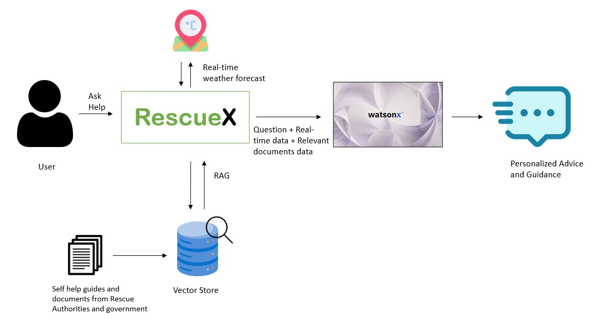

# RescueX: AI-Powered Virtual Rescuer for Natural Disasters and Emergency Response

## Problem Statement:
Natural disasters like floods, earthquakes, landslides, and hurricanes create life-threatening situations where individuals often lack real-time guidance, evacuation support, and communication with rescue teams. On the other side, rescue teams require clear, accurate information about the local area and its environmental conditions to carry out life-saving operations effectively. Without personalized guidance and instant communication with authorities, people affected by disasters face delays in receiving help, heightening both risk and uncertainty. Real-time support is crucial in enabling fast, informed decision-making, ultimately improving the chances of survival.

## Solution Overview:
RescueX is an AI-driven virtual rescuer that helps individuals navigate natural disasters by providing real-time, personalized guidance based on their current situation. Using IBM Watsonx, the platform analyses user inputs (voice/text) along with real-time data on weather, terrain, and local hazards to provide evacuation plans and recommend the safest course of action to handle the situation. RescueX also ensures seamless communication with rescue teams, facilitating timely coordination. The system dynamically adapts to changing conditions, offering personalized emergency kit suggestions and streamlining rescue efforts, helping individuals make fast, informed decisions in critical moments. 

## Architecture Overview:

## Long Description:

RescueX, powered by IBM Watsonx, is an AI-driven virtual rescuer to improve emergency response processes in the context of natural disasters like floods, earthquakes etc. The solution addresses the challenges faced by individuals and rescue teams during life-threatening situations, where timely, precise information is critical to saving lives.
It will be beneficial for various sectors, including emergency management, public safety, and disaster response. By enhancing the flow of information during crises, it helps users make better decisions quickly. This can save lives and lessen the impact of disasters on communities.

## Features:

1. Advanced AI Integration: Built on IBM Watsonx, RescueX processes user inputs (voice/text) to understand individual needs.
2. Safe Route Suggestions: Analyzes current environmental conditions to recommend the safest evacuation routes.
3. Shelter Information: Provides users with the locations of the nearest safe shelters.
4. Personalized Emergency Kits: Recommends essential supplies tailored to the user’s specific situation.
5. Rescue Team Support: Assesses the environment to guide rescue teams efficiently to the user's location during emergencies.
   
## Flow of the Actions: 

1. The User (general public) who is stuck in floods is using the RescueX app to describe his situation and ask for guidance (some kind of self-help) to guide him to Take necessary precaution and preparedness to protect him. 
2. Now based on the question asked, the Watson understands the situation faced by the user, analyses the current weather conditions of the geographical location of the user, thinks (with Reasoning and Acting framework approach), and provides tailored response to the user by acting as a virtual rescuer. Based on the real-time data and flood prediction model, the system can also generate: Emergency evacuation plans. Shelter and rescue center locations. Resources needed for the affected population (e.g., food, water, medical aid).
3. If the situation is critical, the watsonx bot also intimates the Nearby Rescue authorities and connecting them with the user. The Rescuer connects with the User and provides additional support by the time he reaches the affected area.
4. At the other side (Rescue Team) the RescueX analyzes the terrain, nearby water bodies, and current weather conditions around the user's location, using this data to suggest the safest and fastest routes for the team to reach the affected area. It provides real-time insights, such as road conditions, potential obstacles, and flood-prone zones, ensuring that the rescuers can navigate efficiently and reach the user with minimal delay.

## Solution Demo video:

## Productivity gains with RescueX

RescueX  powered by IBM Watsonx significantly enhances productivity in emergency response processes by communication between parties and enabling real-time decision-making. By providing personalized guidance to individuals during crises, the solution minimizes the time and effort required for both users and emergency responders.
Below is an explanation of how the solution enhances productivity, reduces response time, and optimizes resource use:

1. User Self-Help and Safety Measures : RescueX provides guidance on evacuation plans based on the user's geographical location, weather, and terrain conditions. This reduces time spent making decisions and ensures that the user is always following the safest course of action.
2. Faster Response for Rescue Teams : RescueX analyzes the latest geographical and weather data, generating optimized routes for the rescue teams . This removes the need for manual data gathering, allowing teams to make faster decisions and reducing response times.
3. Resource Optimization and Cost Savings : The system streamlines resource allocation by ensuring the best routes and nearest rescue teams are identified saving operational costs. Moreover, RescueX can prioritize critical cases, ensuring the most at-risk individuals receive help first, further optimizing resource distribution.
4. Reduction in Communication Delays : RescueX facilitates instant two-way communication between users and rescue teams, ensuring that all necessary information is available in real-time. This reduces communication delays, improving coordination and speeding up rescue efforts.

These productivity improvements lead to faster, more efficient rescue operations, better resource utilization, and potentially life-saving outcomes during natural disasters.

